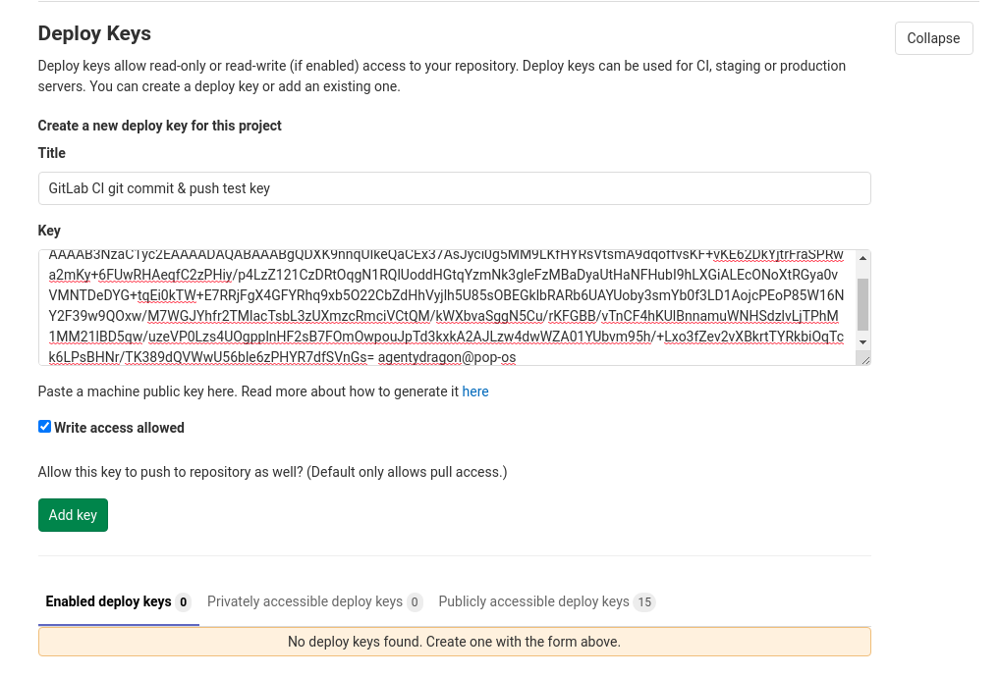
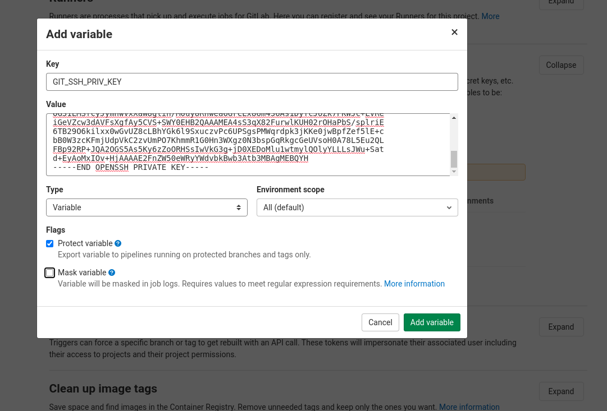
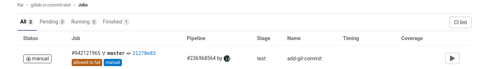
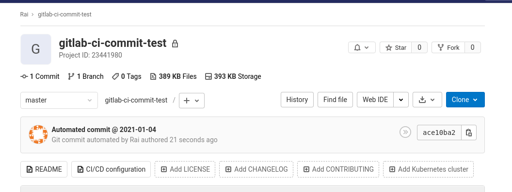
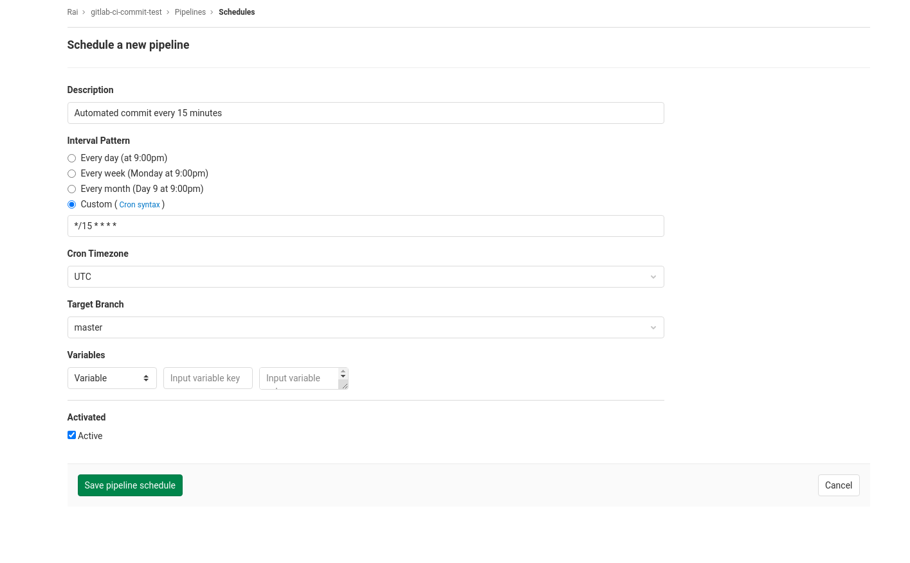

# Automatic RoamResearch backup

[](https://github.com/MatthieuBizien/roam-to-git-demo/actions)
[](https://github.com/MatthieuBizien/roam-to-git/actions)

This script helps you backup your [RoamResearch](https://roamresearch.com/) graphs!

This script automatically
- Downloads a **markdown archive** of your RoamResearch workspace
- Downloads a **json archive** of your RoamResearch workspace
- Download the full **EDN** of your RoamResearch workspace
- Unzips them to your git directory
- Format your markdown, including with **backlinks**
- **Commits and push** the difference to Github

# What's new

**V.02:** 
- Use Selenium library, and roam-to-git seems to be much faster and stable 🔥
- Download the EDN archive

# Demo
[See it in action!](https://github.com/MatthieuBizien/roam-to-git-demo). This repo is updated using roam-to-git.

🚀🚀 **NEW** 🚀🚀 : The [Unofficial backup](https://github.com/MatthieuBizien/RoamResearch-offical-help/) 
of the official [RoamResearch Help Database](https://roamresearch.com/#/app/help)

# Why to use it

- You have a **backup** if RoamResearch loses some of your data.
- You have a **history** of your notes.
- You can **browse** your Github repository easily with a mobile device


# Use it with Github Actions (recommended)

**Note**: [Erik Newhard's guide](https://eriknewhard.com/blog/backup-roam-in-github) shows an easy way of setting up Github Actions without using the CLI.

##  Create a (private) Github repository for all your notes

With [gh](https://github.com/cli/cli): `gh repo create notes` (yes, it's private)

Or [manually](https://help.github.com/en/github/getting-started-with-github/create-a-repo)

## Configure Github secrets 

- Go to github.com/your/repository/settings/secrets 


##### Regarding Google Account Authorization

Due to the limitations of OAuth and complexities with tokens, we are unable to snapshot accounts that are set up with the *Login with Google* option as of now.

To set up backup in this case, you will need to *create*(not exactly) a native account from your old Google Account, which is as simple as using the reset password link found in Roam. 


Once you've reset your password, use the following steps to finish setting up your backup!


### Configuring Github Secrets

Add 3 (separate) secrets where the names are 

`ROAMRESEARCH_USER`

`ROAMRESEARCH_PASSWORD`

`ROAMRESEARCH_DATABASE`

- Refer to [env.template](env.template) for more information

- when inserting the information, there is no need for quotations or assignments


## Add GitHub action

```
cd notes
mkdir -p .github/workflows/
curl https://raw.githubusercontent.com/MatthieuBizien/roam-to-git-demo/master/.github/workflows/main.yml > \
    .github/workflows/main.yml
git add .github/workflows/main.yml
git commit -m "Add github/workflows/main.yml"
git push --set-upstream origin master
```

## Check that the Github Action works

- Go to github.com/your/repository/actions
- Your CI job should start in a few seconds

### Note:

If the backup does not automatically start, try pushing to the repository again

# Use with GitLab CI

This section is based on this article on GitLab blog:
https://about.gitlab.com/blog/2017/11/02/automating-boring-git-operations-gitlab-ci/

## Create a project

Create a project for your notes. We will refer to it as
`YOUR_USER/YOUR_PROJECT`.

## Create key pair for pushing commits

Generate a new key pair that will be used by the CI job to push the new commits.

```bash
$ ssh-keygen -f gitlab-ci-commit
Generating public/private rsa key pair.
Enter passphrase (empty for no passphrase):
Enter same passphrase again:
Your identification has been saved in gitlab-ci-commit-test
Your public key has been saved in gitlab-ci-commit-test.pub
The key fingerprint is:
SHA256:HoQUcbUPJU2Ur78EineqA6IVljk8ZD9XIxiGFUrBues agentydragon@pop-os
The key's randomart image is:
+---[RSA 3072]----+
|   .o=O*..o++.   |
|   .*+.o. o+o    |
|   +.=. .oo. .   |
|    X o..  o  .  |
|   . = oS   o.   |
|    + .. o ...   |
|   + . .o o ...  |
|  . E   .. o ..  |
|        .o.   .. |
+----[SHA256]-----+
```

DO NOT commit the private key (`gitlab-ci-commit`).

## Add the public key as a deploy key

This step allows the CI job to push when identified by the public key.

Go to Project Settings &rarr; Repository (`https://gitlab.com/YOUR_USER/YOUR_PROJECT/-/settings/repository`) &rarr; Deploy Keys.

Paste the content of the public key file (`gitlab-ci-commit-test.pub`), and
enable write access for the public key.



Click "Add Key".

## Add the private key as a CI variable

This step gives the CI job the private key so it can authenticate against
GitLab.

Go to Project Settings &rarr; Pipelines (`https://gitlab.com/YOUR_USER/YOUR_PROJECT/-/settings/ci_cd`) &rarr; Variables.

Click "Add variable", with name `GIT_SSH_PRIV_KEY`, and paste in the content
of the private key file (`gitlab-ci-commit`). You probably want to mark
"Protect". You might want to look up GitLab docs on protected branches.



Click "Add variable".

Also add the following variables with appropriate values:

* `ROAMRESEARCH_USER`
* `ROAMRESEARCH_PASSWORD`
* `ROAMRESEARCH_DATABASE`

## Create a `gitlab_known_hosts` file

In your repo, create and commit a `gitlab_known_hosts` file containing the
needed SSH `known_hosts` entry/entries for the GitLab instance. It will be used
by the CI job to check that it's talking to the right server.

This should work as of 2021-01-04:

```
# Generated by @agentydragon at 2021-01-04 at by `git fetch`ing a GitLab repo
# with an empty ~/.ssh/known_hosts file.

|1|zIQlCRxv+s9xhVCAfGL2nvaZqdY=|jbPpD9GNaS/9Z4iJzE9gw2XCo20= ecdsa-sha2-nistp256 AAAAE2VjZHNhLXNoYTItbmlzdHAyNTYAAAAIbmlzdHAyNTYAAABBBFSMqzJeV9rUzU4kWitGjeR4PWSa29SPqJ1fVkhtj3Hw9xjLVXVYrU9QlYWrOLXBpQ6KWjbjTDTdDkoohFzgbEY=
|1|uj60xYhsW2vAM8BpQ+xZz51ZarQ=|BNIJlvu4rNcmrxd60fkqpChrf9A= ecdsa-sha2-nistp256 AAAAE2VjZHNhLXNoYTItbmlzdHAyNTYAAAAIbmlzdHAyNTYAAABBBFSMqzJeV9rUzU4kWitGjeR4PWSa29SPqJ1fVkhtj3Hw9xjLVXVYrU9QlYWrOLXBpQ6KWjbjTDTdDkoohFzgbEY=
```

## Create `.gitlab-ci.yml`

Create a `.gitlab-ci.yml` file:

```yaml
backup:
  when: manual
  before_script:
    - 'which ssh-agent || ( apt-get update -y && apt-get install openssh-client -y )'
    - eval $(ssh-agent -s)
    - ssh-add <(echo "$GIT_SSH_PRIV_KEY")
    - git config --global user.email "roam-to-git@example.org"
    - git config --global user.name "roam-to-git automated backup"
    - mkdir -p ~/.ssh
    - cat gitlab_known_hosts >> ~/.ssh/known_hosts

    # (Taken from: https://github.com/buildkite/docker-puppeteer/blob/master/Dockerfile)
    # We install Chrome to get all the OS level dependencies, but Chrome itself
    # is not actually used as it's packaged in the pyppeteer library.
    # Alternatively, we could could include the entire dep list ourselves
    # (https://github.com/puppeteer/puppeteer/blob/master/docs/troubleshooting.md#chrome-headless-doesnt-launch-on-unix)
    # but that seems too easy to get out of date.
    - apt-get install -y wget gnupg ca-certificates
    - wget -q -O - https://dl-ssl.google.com/linux/linux_signing_key.pub | apt-key add -
    - echo "deb [arch=amd64] http://dl.google.com/linux/chrome/deb/ stable main" >> /etc/apt/sources.list.d/google.list
    - apt-get update
    - apt-get install google-chrome-stable libxss1 python3-pip -y

    - pip3 install git+https://github.com/MatthieuBizien/roam-to-git.git

    # TODO(agentydragon): Create and publish Docker image with all deps already
    # installed.
  script:
    # Need to clone the repo again over SSH, since by default GitLab clones
    # the repo for CI over HTTPS, for which we cannot authenticate pushes via
    # pubkey.
    - git clone --depth=1 git@gitlab.com:YOUR_USER/YOUR_PROJECT
    - cd YOUR_PROJECT

    # --no-sandbox needed because Chrome refuses to run as root without it.
    - roam-to-git --browser-arg=--no-sandbox .
```

Commit and push.

## To run the pipeline

Go to `https://gitlab.com/YOUR_USER/YOUR_PROJECT/-/jobs`,
press the Play button:



Shortly after you should see an automated commit added to master.



## Scheduled backups

To run the script, say, every hour, go to the project's
CI / CD &rarr; Schedules (`https://gitlab.com/YOUR_USER/YOUR_PROJECT/-/pipeline_schedules`).
Click "New schedule", fill out and submit (like this for every 15 minutes):



# Use it locally

**Note**: if your file system is not case-sensitive, you will not backup notes that have the same name in different 
cases

## Install Roam-To-Git
With [pipx](https://github.com/pipxproject/pipx) 
(if you don't know pipx, you should look at it, it's wonderful!)

`pipx install git+https://github.com/MatthieuBizien/roam-to-git.git`

## Create a (private) Github repository for all your notes

With [gh](https://github.com/cli/cli): `gh repo create notes` (yes, it's private)

Or [manually](https://help.github.com/en/github/getting-started-with-github/create-a-repo)

Then run `git push --set-upstream origin master`

## Configure environment variables

- `curl https://raw.githubusercontent.com/MatthieuBizien/roam-to-git/master/env.template > notes/.env`
- Fill the .env file: `vi .env`
- Ignore it: `echo .env > notes/.gitignore; cd notes; git add .gitignore; git commit -m "Initial commit"`

## Manual backup

- Run the script: `roam-to-git notes/`
- Check your Github repository, it should be filled with your notes :)

## Automatic backup

One-liner to run it with a [cron](https://en.wikipedia.org/wiki/Cron) every hours: 
`echo "0 *  *  *  *  '$(which roam-to-git)' '$(pwd)/notes'" | crontab -`

NB: there are [issues](https://github.com/MatthieuBizien/roam-to-git/issues/43) on Mac with a crontab.

# Debug

Making `roam-to-git` foolproof is hard, as it depends on Roam, on Github Action or the local environment, 
on software not very stable (`pyppeteer` we still love you 😉 )
and on the correct user configuration.

For debugging, please try the following:

- Check that the environment variables `ROAMRESEARCH_USER`, `ROAMRESEARCH_PASSWORD`, `ROAMRESEARCH_DATABASE` are correctly setup
- Login into Roam using the username and the password. 
You may want to ask a new password if you have enabled Google Login, as it solved some user problems.
- Run `roam-to-git --debug` to check the authentification and download work
- Look at the traceback
- Look for similar issues
- If nothing else work, create a new issue with as many details as possible. 
I will try my best to understand and help you, no SLA promised 😇

# Task list

## Backup all RoamResearch data

- [x] Download automatically from RoamResearch
- [x] Create Cron
- [x] Write detailed README
- [x] Publish the repository on Github
- [ ] Download images (they currently visible in Github, but not in the archive so not saved in the repository 😕)

## Format the backup to have a good UI

### Link formatting to be compatible with Github markdown
- [x] Format `[[links]]`
- [x] Format `#links`
- [x] Format `attribute::`
- [ ] Format `[[ [[link 1]] [[link 2]] ]]` 
- [ ] Format `((link))`

### Backlink formatting
- [x] Add backlinks reference to the notes files
- [x] Integrate the context into the backlink
- [x] Manage `/` in file names

### Other formatting
- [x] Format `{{TODO}}` to be compatible with Github markdown
- [ ] Format `{{query}}``

## Make it for others
- [x] Push it to Github
- [x] Add example repository
- [x] Make the backup directory configurable
- [ ] Publicize it
    - [x] [RoamResearch Slack](https://roamresearch.slack.com/) [thread](https://roamresearch.slack.com/archives/CN5MK4D2M/p1588670473431200)
    - [ ] [RoamResearch Reddit](https://www.reddit.com/r/RoamResearch/)
    - [ ] Twitter

## Some ideas, I don't need it, but PR welcome 😀
- [ ] Test it/make it work on Windows
- [x] Pre-configure a CI server so it can run every hour without a computer
    Thanks @Stvad for [#4](https://github.com/MatthieuBizien/roam-to-git/issues/4)!
